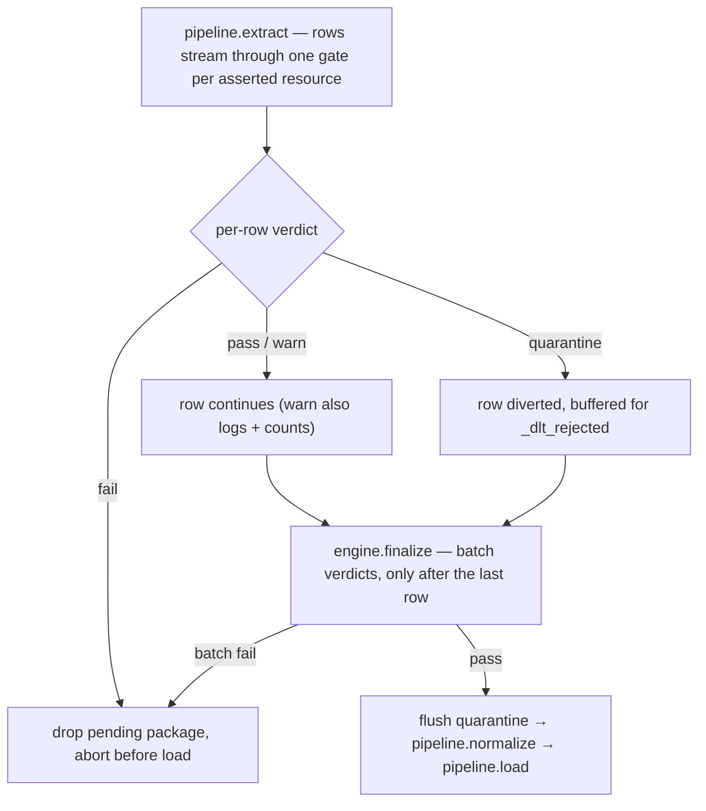

# Pre-load assertions

Assertions are per-resource data-quality gates: you declare them in TOML next to the source they guard, and every `run` and `backfill` enforces them between extract and load — failing data never reaches the destination unless you explicitly downgrade the policy. Read this for the declaration syntax, the four built-in types plus custom predicates, the `fail` / `quarantine` / `warn` policies, and how the gates actually execute inside a run.

**At a glance**

| What it is | When it applies | Requires | On failure | Canonical detail |
|---|---|---|---|---|
| Per-resource data-quality gates declared in TOML, enforced between extract and load | Every `run` and `backfill`, on resources with assertions configured | Core tier for `fail`/`warn`; full tier for `quarantine` (writes `_dlt_rejected`) | `fail` aborts before load; `quarantine` diverts bad rows; `warn` logs and loads | The type and policy tables below; the [failure-semantics contract](failure-semantics.md) |

## Declaring assertions

**Assertions live under `[sources.<X>.dlt_ops.assertions.<resource>]` — one table per resource, in the same `.dlt/config.toml` as everything else.** Against the scaffolded demo project (`dlt-ops init demo --example`, whose `events` resource carries an `id`/`kind`/`occurred_at` Pydantic model):

```toml
[sources.demo_events.dlt_ops.assertions.events]
min_rows_per_load = 1
required_columns = ["id", "kind"]
unique_columns = { value = ["id"], on_failure = "quarantine" }

[[sources.demo_events.dlt_ops.assertions.events.custom]]
predicate = "quality:known_kind"
on_failure = "warn"
```

Each key names an assertion type, and the TOML key **is** the plugin name in the `dlt_ops.assertion` entry-point group — one name across three surfaces: the config key, the registry name, and the `dlt-ops plugins doctor` row.

Values come in two uniform forms, parsed by the engine (never by the plugin): **shorthand** — a scalar or array, normalized to `{"value": ...}` (`min_rows_per_load = 1`, `required_columns = [...]`) — and **table form**, an inline table whose `on_failure` key is popped as the per-assertion override and whose remainder becomes the type's params (`unique_columns = { value = [...], on_failure = "quarantine" }`).

`on_failure` resolves per assertion with a three-level precedence, lowest to highest: the built-in default `"fail"`, a resource-level `on_failure` key in the resource's assertions table, and the per-assertion key inside a table-form value or a `custom` entry. Two keys are reserved inside a resource's assertions table — `on_failure` and `custom` — and every other key must resolve to a registered assertion type; an unregistered name is a `validate` error and a Tier-2 preflight failure, never a silently skipped check.

## The built-in types

**Four types ship in the package and register as `dlt_ops.assertion` entry points — the same path a third-party type uses:**

| Type | Scope | Value | Fails when |
|---|---|---|---|
| `min_rows_per_load` | batch | int >= 0 | the batch carries fewer rows than `value` — guards silent empty loads (upstream outage, broken cursor) |
| `max_rows_per_load` | batch | int >= 1 | the batch carries more rows than `value` — guards runaway extraction (pagination loop, fan-out bug, upstream dump) |
| `required_columns` | row | non-empty list of column names | any named key is absent from the row — key presence, not non-nullness; a key carrying `None` passes (non-null enforcement belongs to the resource's Pydantic `columns=` model) |
| `unique_columns` | row | non-empty list of column names | the row repeats a key combination already seen in this batch; the first occurrence passes, duplicates are the violations |

Two honest bounds, stated rather than hidden. `unique_columns` asserts uniqueness **within the load batch only** — cross-run dedupe is dlt merge/primary-key or warehouse territory. And its accumulator keeps a 16-byte hash per distinct key in memory: roughly 1 GB at 10M distinct keys, acceptable for the scheduled-batch identity this package targets — point large backfills at dlt merge keys instead.

## Custom predicates

**A `[[...custom]]` entry references a plain Python function from TOML — `predicate = "module:attr"` (entry-point syntax; dotted `module.attr` also accepted).** The function receives one row mapping and returns `True` for pass; project-local modules resolve with the project root on `sys.path`, so a `quality.py` next to `.dlt/` just works:

```python
KNOWN_KINDS = {"signup", "login", "purchase"}


def known_kind(row) -> bool:
    return row["kind"] in KNOWN_KINDS
```

Predicates are deliberately the quick path, not a plugin: row-scope only, boolean verdict, failure message auto-generated from the qualname (`predicate quality:known_kind failed`), and `assertion_type = "custom"` in the quarantine table. A batch-scoped or stateful check has outgrown predicates — write a real `AssertionType` plugin (the [plugin-writing guide](../guides/write-plugins.md) has a worked example), which gets a `check_config` hook for static validation and its own accumulator.

## How gates execute

**A run with no assertions configured keeps dlt's single-step `pipeline.run()` path; the moment any selected resource has assertions, the runner splits into dlt's public staged API.** How a row moves through the split — one gate per asserted resource, batch verdicts at `finalize`, quarantine flushed before anything loads, and only a failing gate aborting the run:



The gate is a dlt `add_filter` step appended to each asserted resource, pinned by placement affinity after the resource's Pydantic validator, incremental filter, and the load-timestamp stamp — so assertions observe the final row shape, and only rows that would actually load. A few consequences of that wiring:

- **Evaluation order** — every row feeds each assertion's accumulator in TOML declaration order, custom predicates last.
- **Batch verdicts land at `finalize()`** — batch-scoped types just count during streaming and deliver their verdict only after the last row, which is why the run gates between `extract()` and `normalize()`.
- **One batch = one resource's `pipeline.extract()` output** — not per API page, not per dlt load package; each [backfill](backfill.md) chunk is its own run, so it gets its own batch.
- **Concurrency-safe** — accumulator updates take one lock per resource gate, so `parallelized=True` resources stay correct.

The transcript announces the wiring up front:

```text
2026-07-16 18:18:04|[INFO]|dlt_ops.assertions.engine|Assertion gate attached to resource 'events' (4 assertion(s), declaration order)
```

## `fail`, `quarantine`, `warn`

**What a failing verdict does depends on the resolved policy and the assertion's scope** — this table is the short form of the [failure-semantics contract](failure-semantics.md), which is canonical:

| Policy | Row-scoped assertion | Batch-scoped assertion |
|---|---|---|
| `fail` (default) | Aborts the run immediately; nothing loads; the pending extracted package is dropped | Aborts after extract, before normalize/load; pending package dropped |
| `quarantine` | The row is removed from the stream and written to `_dlt_rejected`; the load proceeds with the surviving rows | **Invalid config** — a `validate` error: there are no specific rows to quarantine when a batch verdict fails |
| `warn` | Logged and counted; the row loads anyway | Logged and counted; the batch loads anyway |

**`fail`** — with `min_rows_per_load = 10` against the demo's 6-row resource, the run exits 1 between extract and load:

```text
2026-07-16 18:18:55|[INFO]|dlt_ops.discovery.runner|Dropped pending load package(s) after assertion failure
dlt_ops.assertions.models.AssertionFailedError: assertion 'min_rows_per_load' failed on demo_events.events: row count 6 is below min_rows_per_load 10
```

The `Dropped pending load package(s)` line is load-bearing: dlt persists the extracted package in the pipeline working directory and the *next* run would auto-load it, silently defeating the assertion — so the runner deletes the rejected package as part of failing. The [runs ledger](runs-ledger.md) still records the outcome with the one-line error summary.

**`quarantine`** — with a duplicate `id = 6` injected into the demo's fixture rows, the same run completes and diverts exactly the offending row:

```text
2026-07-16 18:19:13|[INFO]|dlt_ops.discovery.runner|Quarantined 1 row(s) to _dlt_rejected
1 load package(s) were loaded to destination duckdb and into dataset demo_data
```

Six rows land in `demo_data.events`; the seventh is in the quarantine table with full context. Reading it back from the demo's DuckDB file:

```bash
python - <<'PY'
import duckdb
con = duckdb.connect("demo_events_pipeline.duckdb", read_only=True)
print(con.sql("SELECT assertion_type, violation, run_id, row_json FROM demo_data._dlt_rejected"))
PY
```

```text
┌────────────────┬────────────────────┬──────────────────────────────────┬─────────────────────────────────────────────┐
│ assertion_type │     violation      │              run_id              │                  row_json                   │
├────────────────┼────────────────────┼──────────────────────────────────┼─────────────────────────────────────────────┤
│ unique_columns │ duplicate key id=6 │ 592f8b43ecc2467f8ecdbd706c898d90 │ {"id": 6, "kind": "purchase", "occurred_at" │
│                │                    │                                  │ : "2026-01-04 16:21:00+00:00"}              │
└────────────────┴────────────────────┴──────────────────────────────────┴─────────────────────────────────────────────┘
```

**`warn`** — the custom predicate above fires on the demo's `logout` row, and the load proceeds. Each (resource, type) pair logs its first five violations individually and counts the rest; `finalize` emits one summary line:

```text
2026-07-16 18:18:04|[WARNING]|dlt_ops.assertions.engine|assertion 'custom' warn on demo_events.events: predicate quality:known_kind failed
2026-07-16 18:18:04|[WARNING]|dlt_ops.assertions.engine|assertion warn summary for demo_events.events: custom=1
```

Warn counts stay in logs in v0.1 — they are not written to the destination. That is the acknowledged gap of the policy set: `fail` outcomes land in the ledger's `error_summary`, `quarantine` outcomes are queryable in `_dlt_rejected`, and `warn` is advisory by definition.

## The quarantine table: `_dlt_rejected`

**Quarantined rows are written to one `_dlt_rejected` table per destination dataset — the same dataset the data lands in, the same co-location the [runs ledger](runs-ledger.md) uses.** The row payload is a single JSON column rather than typed columns: rejected rows come from arbitrary resources with disjoint schemas, and one JSON-payload table stays immune to schema evolution and queryable with every full-tier destination's JSON functions.

| Column | Type | Meaning |
|---|---|---|
| `pipeline_name` | VARCHAR, not null | The dlt pipeline that ran |
| `source_section` | VARCHAR, not null | Config-section name of the source |
| `resource_name` | VARCHAR, not null | Resource whose gate rejected the row |
| `run_id` | VARCHAR, not null | dlt-ops run id — joins `_dlt_ops_runs` |
| `assertion_type` | VARCHAR, not null | Type name (`unique_columns`, ...) or `custom` |
| `assertion_params` | VARCHAR, not null | JSON snapshot of the normalized params, predicate qualname included |
| `violation` | VARCHAR, not null | The verdict message (`duplicate key id=6`) |
| `rejected_at` | TIMESTAMPTZ, not null | One timestamp per flush, UTC |
| `row_json` | VARCHAR, not null | The full rejected row, JSON-serialized |

The table is created lazily on first write, and all writes go through the [`DestinationAdapter` boundary](destinations-and-tiers.md) with bound parameters. `run_id` makes per-run analysis one join away:

```bash
python - <<'PY'
import duckdb
con = duckdb.connect("demo_events_pipeline.duckdb", read_only=True)
print(con.sql("SELECT r.status, r.records_loaded, q.assertion_type, q.violation FROM demo_data._dlt_ops_runs r JOIN demo_data._dlt_rejected q ON r.run_id = q.run_id"))
PY
```

```text
┌───────────┬────────────────┬────────────────┬────────────────────┐
│  status   │ records_loaded │ assertion_type │     violation      │
├───────────┼────────────────┼────────────────┼────────────────────┤
│ completed │              6 │ unique_columns │ duplicate key id=6 │
└───────────┴────────────────┴────────────────┴────────────────────┘
```

Two deliberate policies, both canonical in the [failure-semantics contract](failure-semantics.md). A failed quarantine **write aborts the run**: the rows were already removed from the load stream, and dropping them unrecorded would be silent data loss — the exact opposite of the runs ledger's best-effort policy, because `_dlt_rejected` holds actual data, not bookkeeping. And there is no retention story yet: no TTL, no partitioning; cleanup is a manual `DELETE FROM _dlt_rejected WHERE ...` until a retention design lands for the system tables together.

## Tier interaction

**Quarantine needs a destination the toolchain can write SQL against — a registered `DestinationAdapter`, i.e. [full tier](destinations-and-tiers.md).** On a core-tier destination a resource configured for `quarantine` is refused at Tier-2 preflight, before extract, because a gate the config demands must not silently downgrade to "load the bad rows anyway". The same demo config pointed at a local `filesystem` destination:

```text
dlt_ops.preflight.DestinationCapabilityError: destination 'filesystem' has no registered DestinationAdapter, but this run engages adapter-gated feature(s): assertion quarantine (on_failure = "quarantine" on resource(s): events). Features gated on an adapter: runs ledger and status, checkpoints, backfill, clean (remote), reconcile, assertion quarantine. Registered adapters: 'bigquery', 'duckdb', 'postgres'. Install a DestinationAdapter under the 'dlt_ops.destination' entry-point group, switch to a destination that has one, or remove the feature from the run; see docs/reference/destinations.md.
```

`fail` and `warn` work at every tier — they touch no destination SQL. Both `validate` (the `destination_capability` rule) and the preflight derive quarantine engagement from the same parsed config, so the two tiers cannot drift on when quarantine gates a destination.

## What `validate` checks

**Three always-on core rules cover assertions — separate IDs so a project can exempt column checking without disabling structural validation** ([rules reference](../configuration/rules.md)): `assertion_config_valid` (well-formed tables, registered type names, `on_failure` domain, params accepted by the type, no quarantine on batch scope), `assertion_columns_exist` (column references against the resource's declared Pydantic model), and `assertion_predicate_resolvable` (predicates import and are callable — probed in the same audit-hook sandbox as source modules, so a predicate module's import side effects never run inside `validate` and import-time network I/O is a finding like any other). A typo'd type and a phantom column, caught statically:

```text
✗ 2 error(s):
  [demo_events] assertions.events.min_rows: unknown assertion type 'min_rows'; registered assertion types: 'max_rows_per_load', 'min_rows_per_load', 'required_columns', 'unique_columns'. Install one under the 'dlt_ops.assertion' entry-point group, then inspect the registry with `dlt-ops plugins doctor`.
  [demo_events] assertions.events.required_columns: required_columns references column 'amount', which is absent from the declared Pydantic model of resource 'events'
```

And quarantine on a batch-scoped type:

```text
✗ 1 error(s):
  [demo_events] assertions.events.min_rows_per_load: assertion type 'min_rows_per_load' is batch-scoped; on_failure = "quarantine" is invalid — there are no specific rows to quarantine when a batch verdict fails
```

There is no assertion dry-run and no flag to add one: `validate` is static by definition, and a *sampled* dry-run would be worse than nothing for exactly the assertions that matter — uniqueness and row counts are only decidable on the full batch. The rehearsal is the real thing against a dev destination (`run` into local DuckDB). The runtime does not trust that `validate` ran, either: engine construction re-runs the structural checks and imports the predicates before extract, so a bad config hard-fails at Tier 2 even on a scheduler that never invokes the CLI — [validation](validation.md) covers the two-tier posture.

## Design notes

- **`fail` is the default** because the safe default is "bad data does not load" with zero side effects you didn't ask for: `quarantine` as a default would silently create and write a side table, and `warn` as a default makes assertions decorative.
- **Gates stream inside extract** (one `add_filter` per resource) instead of re-reading dlt's extracted package files between the stages: the package layout is dlt-internal, a scan would double-read every row, and quarantine would mean rewriting dlt's files to remove rows. Streaming observation uses only dlt's public API — the cost is that quarantined rows buffer in memory until the flush.
- **Verdict policy is engine-owned.** Assertion types never see `on_failure`, never write quarantine rows, never touch destination clients — they observe rows and return messages, which keeps a type trivially testable and keeps policy in exactly one place.
- **The runs ledger carries no assertion column in v0.1** — `fail` already lands as a failed run with the assertion in `error_summary`, and quarantine counts are one `GROUP BY` over `_dlt_rejected` away; an `assertion_failures` column is deferred as a purely additive change.

## Where next

- [Assertions guide](../guides/assertions.md) — gating a resource end to end: trigger all three policies and read the quarantine back
- [Failure semantics](failure-semantics.md) — the canonical contract for what each policy does to a run
- [Destinations and tiers](destinations-and-tiers.md) — why quarantine is adapter-gated and how tiers resolve
