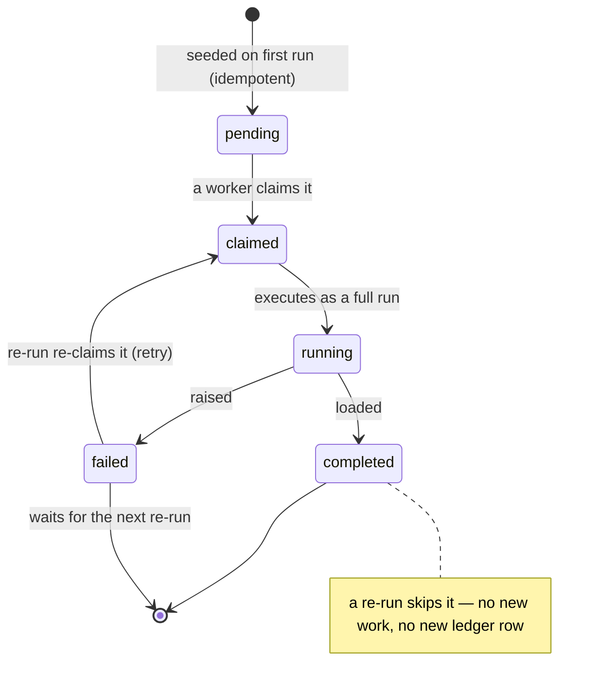

# Backfill

`pipeline backfill` re-ingests a historical window as a sequence of resumable chunks: each chunk is its own pipeline run with injected `[from, to)` bounds, its own row in the [runs ledger](runs-ledger.md), and its own entry in a `_dlt_backfills` state table — so a crash costs you one chunk, not the window, and re-running the same command is a resume, not a duplicate. Read this before backfilling anything long enough to fail partway: which invariants the chunk state machine guarantees, what the command refuses to do, and why.

**At a glance**

| What it is | When it applies | Requires | On failure | Canonical detail |
|---|---|---|---|---|
| `pipeline backfill` — re-ingests a `[from, to)` window as a sequence of resumable chunks, each its own run | Re-ingesting history; every selected resource must declare an incremental cursor | Full tier (a `DestinationAdapter`) for the `_dlt_backfills` state table | A crash costs one chunk; re-running the same triple resumes — skip completed, retry failed, continue pending | [Runs ledger](runs-ledger.md) for chunk rows; [failure-semantics](failure-semantics.md) for the refusals |

## The command and the window contract

**`pipeline backfill` takes a source, a `[from, to)` window, and a chunk size:**

```bash
dlt-ops pipeline backfill <source> --from <timestamp> --to <timestamp> --chunk <interval>
```

The window is `[from, to)` — start inclusive, end exclusive, matching Airflow's `[data_interval_start, data_interval_end)` and dlt's own incremental convention, so a daily backfill and the daily schedule that takes over afterwards meet at a boundary without overlap or gap.

Bounds must be ISO-8601 with an explicit timezone offset and are normalized to UTC at parse time; naive timestamps are rejected, because a bound that means something different on the operator's laptop and the scheduler's container would silently shift the window:

```text
Error: --from '2026-01-01T00:00:00' is timezone-naive; pass an explicit offset (e.g. 2026-01-01T00:00:00Z or 2026-01-01T00:00:00+00:00) — bounds are normalized to UTC
```

`--chunk` accepts exactly three forms — `<N>d`, `<N>h`, `<N>m` — and nothing else, not even ISO-8601 durations:

```text
Error: invalid --chunk '1w': simple <N>d / <N>h / <N>m forms only (e.g. 7d, 24h, 30m)
```

The strictness is load-bearing: the chunk spelling is an input to the backfill's identity (below), so two spellings of the same interval (`7d` and `1w`) must not be able to fork one backfill into two.

## From window to chunks

**The window splits into consecutive `[from, to)` chunks of `--chunk` size, the last one clamped to `--to` when the window does not divide evenly.** Chunks execute sequentially, and each one is a full pipeline run through the same runner `pipeline run` uses — Tier-2 preflight, assertions, the runs ledger, and trace persistence all apply per chunk. The chunk's bounds are injected via dlt's `TimeIntervalContext`, so every incremental resource observes `[chunk_from, chunk_to)` as its window without any change to your source code.

Identity is deterministic at both levels, and that determinism is the whole resume story:

- **`backfill_id`** = `sha256("<source>|<from>|<to>|<chunk>")[:16]` — the same `--from --to --chunk` triple always names the same backfill, which is what makes re-running the command a resume rather than a second backfill.
- **Per-chunk `run_id`** = `sha256("<source>|<chunk_from>|<chunk_to>")[:16]` — a retried chunk reuses its identity, so it also reuses its [checkpoint](checkpoints.md) state, and its ledger rows join to its state row on `run_id`.

Each executed chunk writes its own `_dlt_ops_runs` row with `trigger_source = "backfill"` and the shared `backfill_id`, so `pipeline status` shows chunk-level history and the ledger can group one invocation's chunks.

## Per-chunk state: `_dlt_backfills`

**Chunk progress lives in a `_dlt_backfills` table in the source's own resolved destination and dataset — the same locality rule as the runs ledger, so resumability never depends on a coordination store the destination itself doesn't provide.** Each row is one chunk: its bounds, its `status`, claim metadata (`claimed_by`, `claimed_at`), timing, `records_loaded`, and its deterministic `run_id`. The row also stores the full plan (`backfill_from`, `backfill_to`, `chunk_size`): on resume the stored triple is verified against what you typed, so a mismatched re-invocation fails with `backfill <id> exists with different inputs` instead of trusting the hash alone.

`status` moves through a locked vocabulary: `pending` → `claimed` → `running` → `completed` or `failed`. Seeding is idempotent — missing chunks are inserted as `pending`, existing rows are left alone — and a resume claims only `pending` and `failed` rows.

The chunk state machine — a re-run skips what finished and re-claims what failed, so each chunk still executes exactly once (the exact status vocabulary above and the state table below are canonical):



Unlike the best-effort ledger, these writes are load-bearing: chunk state is what guarantees each chunk executes exactly once, so a failed state write raises instead of logging. That is also why backfill is a [full-tier feature](destinations-and-tiers.md) — the state table is read and written through the `DestinationAdapter` boundary.

## A backfill, killed and resumed

**The scaffolded demo project (`dlt-ops init demo --example`) plus one added pipeline is enough to watch the whole state machine.** `web/source/web_events.py` declares the one thing backfill requires — an incremental cursor — and a fault-injection hook for the demo:

```python
"""Backfillable source: every selected resource declares an incremental cursor."""

import os
from datetime import UTC, datetime

import dlt
import pydantic


class PageView(pydantic.BaseModel):
    id: int
    occurred_at: datetime


_ROWS = [{"id": n, "occurred_at": datetime(2026, 1, n, 12, 0, tzinfo=UTC)} for n in range(1, 7)]

# Fault-injection hook for the resume demo: set to a chunk's start timestamp
# (ISO-8601) and the "API" dies when that chunk runs.
FAIL_FROM_ENV = "WEB_EVENTS_FAIL_FROM"


@dlt.resource(name="page_views", columns=PageView, primary_key="id", write_disposition="append")
def page_views(occurred_at=dlt.sources.incremental("occurred_at", initial_value=datetime(2020, 1, 1, tzinfo=UTC))):
    if os.environ.get(FAIL_FROM_ENV) == occurred_at.start_value.isoformat():
        raise RuntimeError(f"injected API failure for window starting {occurred_at.start_value}")
    yield _ROWS
```

```toml
[sources.web_events]

[sources.web_events.dlt_ops]
schedule = "@manual"
dataset = "web_raw"
```

Backfill five days in daily chunks, with the fault armed for chunk 3's window:

```bash
WEB_EVENTS_FAIL_FROM="2026-01-03T00:00:00+00:00" dlt-ops pipeline backfill web_events --from 2026-01-01T00:00:00Z --to 2026-01-06T00:00:00Z --chunk 1d
```

```text
chunk 1/5 [2026-01-01T00:00:00+00:00 → 2026-01-02T00:00:00+00:00): running (run_id=2fe712c1ca2c99a0)
chunk 1/5 [2026-01-01T00:00:00+00:00 → 2026-01-02T00:00:00+00:00): completed (1 records)
chunk 2/5 [2026-01-02T00:00:00+00:00 → 2026-01-03T00:00:00+00:00): running (run_id=91f2aafcc3320c98)
chunk 2/5 [2026-01-02T00:00:00+00:00 → 2026-01-03T00:00:00+00:00): completed (1 records)
chunk 3/5 [2026-01-03T00:00:00+00:00 → 2026-01-04T00:00:00+00:00): running (run_id=559264ef1526bd83)
Error: chunk 3/5 [2026-01-03T00:00:00+00:00 → 2026-01-04T00:00:00+00:00) failed: PipelineStepFailed: Pipeline execution failed at `step=extract` ... injected API failure for window starting 2026-01-03 00:00:00+00:00. Completed chunks are recorded — re-run the same --from/--to/--chunk to resume.
```

The invocation exits 1 at the first failed chunk — no skip-ahead, because chunks run in window order and a systematic failure (expired credentials, a source outage) should stop the backfill, not burn through every remaining chunk. The state table now reads, straight from `web_raw._dlt_backfills`:

```text
┌──────────┬────────────────────────┬────────────────────────┬───────────┬────────────────┬──────────────────┐
│ chunk_id │       chunk_from       │        chunk_to        │  status   │ records_loaded │      run_id      │
├──────────┼────────────────────────┼────────────────────────┼───────────┼────────────────┼──────────────────┤
│ 000000   │ 2026-01-01 00:00:00+00 │ 2026-01-02 00:00:00+00 │ completed │              1 │ 2fe712c1ca2c99a0 │
│ 000001   │ 2026-01-02 00:00:00+00 │ 2026-01-03 00:00:00+00 │ completed │              1 │ 91f2aafcc3320c98 │
│ 000002   │ 2026-01-03 00:00:00+00 │ 2026-01-04 00:00:00+00 │ failed    │           NULL │ 559264ef1526bd83 │
│ 000003   │ 2026-01-04 00:00:00+00 │ 2026-01-05 00:00:00+00 │ pending   │           NULL │ cf57c9a304c61cb8 │
│ 000004   │ 2026-01-05 00:00:00+00 │ 2026-01-06 00:00:00+00 │ pending   │           NULL │ 2398048a9866e857 │
└──────────┴────────────────────────┴────────────────────────┴───────────┴────────────────┴──────────────────┘
```

Re-run the exact same command, without the fault:

```bash
dlt-ops pipeline backfill web_events --from 2026-01-01T00:00:00Z --to 2026-01-06T00:00:00Z --chunk 1d
```

```text
chunk 1/5 [2026-01-01T00:00:00+00:00 → 2026-01-02T00:00:00+00:00): already completed, skipping
chunk 2/5 [2026-01-02T00:00:00+00:00 → 2026-01-03T00:00:00+00:00): already completed, skipping
chunk 3/5 [2026-01-03T00:00:00+00:00 → 2026-01-04T00:00:00+00:00): running (run_id=559264ef1526bd83)
chunk 3/5 [2026-01-03T00:00:00+00:00 → 2026-01-04T00:00:00+00:00): completed (1 records)
chunk 4/5 [2026-01-04T00:00:00+00:00 → 2026-01-05T00:00:00+00:00): running (run_id=cf57c9a304c61cb8)
chunk 4/5 [2026-01-04T00:00:00+00:00 → 2026-01-05T00:00:00+00:00): completed (1 records)
chunk 5/5 [2026-01-05T00:00:00+00:00 → 2026-01-06T00:00:00+00:00): running (run_id=2398048a9866e857)
chunk 5/5 [2026-01-05T00:00:00+00:00 → 2026-01-06T00:00:00+00:00): completed (1 records)

Backfill d7a7c6e21e0d8ecb: 3 completed, 2 skipped, 0 claimed elsewhere (5 chunks)
```

Completed chunks are skipped, the failed chunk is retried under its original `run_id` (`559264ef1526bd83` — same identity, same checkpoint namespace), and the pending tail runs. A third invocation is a no-op: `0 completed, 5 skipped`, and no new ledger rows — a skipped chunk's original row already says `completed`, so skipping touches nothing. The loaded table holds exactly rows 1–5, once each; row 6 sits at `2026-01-06T12:00`, past `--to`, and is correctly excluded by the `[from, to)` contract. `dlt-ops pipeline status --limit 6` keeps the honest history, failed attempt included, with both chunk-3 rows sharing one `run_id`:

```text
Source: web_events
  Status     Started              Completed            Records   Trigger    Resource        Run ID
  completed  2026-07-16 18:05:47  2026-07-16 18:05:47  1         backfill   -               2398048a9866
  completed  2026-07-16 18:05:46  2026-07-16 18:05:46  1         backfill   -               cf57c9a304c6
  completed  2026-07-16 18:05:44  2026-07-16 18:05:45  1         backfill   -               559264ef1526
  failed     2026-07-16 18:05:00  2026-07-16 18:05:00  -         backfill   -               559264ef1526
    ✗ PipelineStepFailed: Pipeline execution failed at `step=extract` ... injected API failure for window starting 2026-01-03 00:00:00+00:00
  completed  2026-07-16 18:04:59  2026-07-16 18:05:00  1         backfill   -               91f2aafcc332
  completed  2026-07-16 18:04:58  2026-07-16 18:04:59  1         backfill   -               2fe712c1ca2c
```

## Concurrent invocations

**Two `dlt-ops pipeline backfill` invocations of the same triple — two terminals, or a retrying orchestrator task next to a manual run — coordinate exclusively through the state table.** Before executing a chunk, a worker claims it with an optimistic compare-and-swap: `UPDATE ... SET status = 'claimed', claimed_by = ? WHERE ... AND status IN ('pending', 'failed')`. Because the adapter boundary exposes no rows-affected count, the outcome is verified by reading the row back — the worker won iff `claimed_by` is its own token (`host:pid` by default).

Losing is silent by design: the chunk shows up as `claimed by another worker, moving on` and lands in the summary's `claimed elsewhere` tally, which is not a failure. There are no in-process locks and no lease server; every chunk executes exactly once, and the package's concurrency tests pin exactly that.

## What backfill refuses to do

**Backfill inherits the [Tier-2 preflight](validation.md) and adds its own entry checks; everything below fails before any chunk runs or any state row is written, per the [failure-semantics contract](failure-semantics.md).**

**No incremental cursor, no backfill.** Every selected resource must declare a `dlt.sources.incremental` cursor — for a resource without one, the injected interval is silently ignored, and each "chunk" would re-extract the entire source while looking like a successful windowed run. The repository's `examples/basic_project` demonstrates the refusal: its `events` resource has a cursor, but the whole-source backfill also selects `actors`, which does not:

```bash
dlt-ops pipeline backfill github_events_api --from 2026-01-01T00:00:00Z --to 2026-01-02T00:00:00Z --chunk 6h
```

```text
Error: backfill bounds were supplied but resource(s) without an incremental cursor are selected: actors. Declare a dlt.sources.incremental cursor or deselect them.
```

This refusal is working as intended, not a limitation to route around: the honest failure beats a backfill that quietly multiplies your source traffic by the chunk count. There is no per-resource selection flag on `backfill` in v0.1, so the unit of refusal is the source — give every resource in the source a cursor, or split cursor-less resources into their own source.

**No `DestinationAdapter`, no backfill.** Chunk state is adapter-gated, so a core-tier destination is refused up front — before chunk math, before the state table is touched:

```text
Error: destination 'filesystem' has no registered DestinationAdapter, but this run engages adapter-gated feature(s): backfill (chunk state in _dlt_backfills). Features gated on an adapter: runs ledger and status, checkpoints, backfill, clean (remote), reconcile, assertion quarantine. Registered adapters: 'bigquery', 'duckdb', 'postgres'. Install a DestinationAdapter under the 'dlt_ops.destination' entry-point group, switch to a destination that has one, or remove the feature from the run; see docs/reference/destinations.md.
```

**No import-unsafe source.** The Phase-2 [discovery](discovery.md) verdict is an entry gate: a source module that failed to import, or that violated import safety (network I/O or disk writes at import time), is rejected with the actual finding rather than run.

## Design notes

**A single-interval backfill — one run for the whole window — was considered and rejected:** it works on toy datasets and dies on production-scale ones, where 18 months against a rate-limited API in one transaction means memory pressure, retry storms, or a throttled key. Chunking makes progress visible (`chunk N/total`), failure cheap (one chunk), and resume free (the state table).

**Checkpoints and backfill compose without sharing state:** injected bounds change the incremental's start value, and `@with_checkpoints` derives its namespace from exactly that value — so each chunk checkpoints into its own namespace, a retried chunk resumes from its own mid-chunk progress, and no chunk can poison another's resume point.

The checkpoint namespace hash and the backfill `run_id` are deliberately different recipes; the sanctioned join between chunk state and run history is `_dlt_backfills.run_id` ↔ `_dlt_ops_runs.run_id`. Backfill is also the recovery path [checkpoints](checkpoints.md) point at: a checkpointed run that failed mid-extract skips the span below its checkpoint on resume, and a windowed backfill over that span is how you get those rows back.

## Where next

- [Backfill guide](../guides/backfill.md) — the task-shaped walkthrough, including the refusal cases
- [Checkpoints](checkpoints.md) — per-chunk namespaces, and when to combine checkpoints with backfill
- [Runs ledger](runs-ledger.md) — how chunk rows land in `_dlt_ops_runs` and read back through `status`
