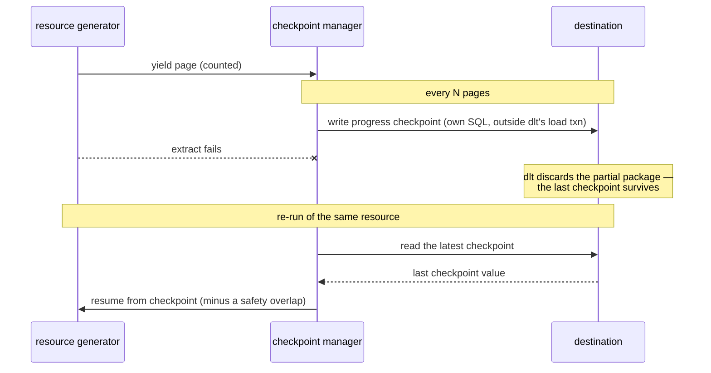

# Checkpoints

A long paginated extract that dies at page 40 of 50 is pure loss in vanilla dlt: the incremental cursor only advances when a load succeeds, so the next run re-extracts the whole window. `@with_checkpoints` persists pagination progress to the destination *during* extraction, so a failed run resumes from the last checkpoint instead of the window start. Read this for the exact semantics — what a checkpoint claims, what it deliberately does not, and why the feature needs a full-tier destination.

**At a glance**

| What it is | When it applies | Requires | On failure | Canonical detail |
|---|---|---|---|---|
| `@with_checkpoints` — writes extraction progress to a checkpoint table in the destination every N pages | During extract, on any resource it decorates (under `@dlt.resource`) | Full tier (a `DestinationAdapter`); refused before extract otherwise | A failed checkpoint write logs and continues; resume trusts the checkpoint and never reclaims rows below it | The parameter table below; [backfill](backfill.md) for per-chunk namespaces |

## Mechanism

**`with_checkpoints` is a public export of `dlt_ops`; it decorates a resource's generator function and must sit under `@dlt.resource`, closest to the function.** Applied on top it would replace the `DltResource` with a plain generator, silently dropping the resource's name, write disposition, and hints, so that order raises immediately at decoration time (`TypeError: @with_checkpoints must be applied under @dlt.resource, not on top of it: ...`).

The shipped example project (`examples/basic_project`) pairs it with an incremental cursor:

```python
from dlt_ops import with_checkpoints

@dlt.resource(
    name="events",
    columns=Event,
    primary_key="id",
    write_disposition="append",
    schema_contract={"tables": "evolve", "columns": "freeze", "data_type": "freeze"},
)
@with_checkpoints(cursor_field="occurred_at", frequency=2)
def events(occurred_at=dlt.sources.incremental("occurred_at", initial_value=EVENTS_INITIAL_TIMESTAMP)):
    for page in FixtureClient("events.jsonl").pages(since=occurred_at.start_value):
        yield page
```

Every page the generator yields is counted; every `frequency` pages, the maximum cursor value of the current page is written as a row to a checkpoint table in the destination — through the [`DestinationAdapter` boundary](destinations-and-tiers.md), in its own SQL statement, outside dlt's load transaction.

The cursor value is serialized to a string (ISO-8601 for datetimes), and the mechanism assumes pages arrive in roughly ascending cursor order, since the stored value is per-page, not a running maximum across unordered pages.

| Parameter | Default | Meaning |
|---|---|---|
| `cursor_field` | required | Name of the incremental parameter (and, unless the incremental says otherwise, the field in the data) |
| `frequency` | `10` | Checkpoint every N pages |
| `offset_seconds` | `1` | Safety overlap subtracted from the checkpoint on resume (datetime cursors) |
| `checkpoint_table` | `_dlt_custom_checkpoints` | Destination table holding checkpoint rows |
| `cleanup_days` | `7` | Completed checkpoints older than this are deleted after a successful run |
| `value_parser` | ISO/datetime parse | Turns the stored string back into the cursor's type; pass your own for non-datetime cursors |

Checkpoint rows carry `pipeline_name`, `resource_name`, `run_id`, `checkpoint_value`, `page_number`, `records_processed`, `status` (`active` or `completed`), and `created_at` / `updated_at`. When the resource finishes cleanly, its active rows are marked `completed` and completed rows older than `cleanup_days` are deleted; when it fails, the active rows stay — they are the resume state.

The `run_id` column isolates concurrent windows: it is derived from the incremental's initial (or start) value — `sha256(<serialized value>)[:16]` — so an hourly run and a backfill chunk over a different window checkpoint into separate namespaces instead of poisoning each other's resume points. [Backfill](backfill.md) leans on exactly this: injected chunk bounds change the start value, so each chunk gets its own checkpoint namespace, and a retried chunk resumes from its *own* progress.

An incremental with no initial or start value falls back to `run_id = "default"` (with a warning); a resource with no detectable incremental gets `NULL`, which is likewise isolated.

The write-and-resume lifecycle — the manager persists progress mid-extract, and a failed run resumes from the last durable checkpoint rather than re-extracting the window:



## Resume, end to end

**The example project ships a fault-injection hook that kills the fixture "API" after N pages.** The window holds 20 rows at 3 rows per page, and `frequency=2` checkpoints every second page:

```bash
GITHUB_EVENTS_FAIL_AFTER_PAGE=3 dlt-ops pipeline run -s github_events_api -y
```

```text
[events] Run isolation: value=2026-01-01T00:00:00+00:00, run_id=2db0bb0b60653f75
[events] Checkpoint saved: page 2, 6 records, value: 2026-01-01T05:00:00+00:00
RuntimeError: injected API failure after page 3 (GITHUB_EVENTS_FAIL_AFTER_PAGE)
```

The run exits 1 at the extract step, so dlt loads nothing — but the page-2 checkpoint is already durable in the destination, and `dlt-ops checkpoints list --pipeline github_events_api_pipeline` shows it still active (`--pipeline` is required, and it takes the dlt pipeline name, not the dlt-ops source name):

```text
Found 1 checkpoint(s):

Resource             RunID      Checkpoint                Pages    Records    Status     Created
------------------------------------------------------------------------------------------------------------------------
events               2db0bb0b   2026-01-01T05:00:00+00:00 2        6          active 2026-07-16 15:52:01.281510+00:00
```

Re-run without the fault. On entry the decorator loads the latest active checkpoint for this (pipeline, resource, `run_id`) and overrides the incremental's `start_value` with the checkpoint minus `offset_seconds` — the one-second overlap re-fetches the boundary row so a cursor tie at the checkpoint cannot be skipped (for non-datetime cursors parsed via `value_parser`, no offset is applied; resume starts exactly at the checkpoint):

```bash
dlt-ops pipeline run -s github_events_api -y
```

```text
[events] Run isolation: value=2026-01-01T00:00:00+00:00, run_id=2db0bb0b60653f75
[events] Resuming from checkpoint: 2026-01-01T05:00:00+00:00 (adjusted: 2026-01-01 04:59:59+00:00)
[events] Checkpoint saved: page 2, 6 records, value: 2026-01-01T10:00:00+00:00
[events] Checkpoint saved: page 4, 12 records, value: 2026-01-01T16:00:00+00:00
[events] Checkpoints marked as completed
[events] Cleaned up checkpoints older than 7 days
1 load package(s) were loaded to destination duckdb and into dataset github_events_raw
```

The [runs ledger](runs-ledger.md) keeps both outcomes:

```text
Source: github_events_api
  Status     Started              Completed            Records   Trigger    Resource        Run ID
  completed  2026-07-16 15:52:23  2026-07-16 15:52:24  20        cli        -               4bbac556976a
  failed     2026-07-16 15:52:00  2026-07-16 15:52:01  -         cli        -               db11b0c99fa4
```

## What a checkpoint claims — and what it does not

**A checkpoint is a statement about extraction progress, persisted outside dlt's load transaction.** Resume trusts the checkpoint, not the destination — it never checks what actually landed. Be precise about what that buys per failure mode:

- **Failure during extract** (the demo above): dlt discards the partial package, so nothing below the checkpoint from the failed run ever loaded — and resume does not go back for it. In the transcript: the window holds 20 rows, the failed run extracted pages 1–3 and checkpointed at page 2 (`05:00`), and the resumed run extracts and loads exactly the 15 rows from `05:00` on. The five rows before the checkpoint (`00:00`–`04:00`) are now below both the checkpoint and dlt's advanced incremental cursor, so later scheduled runs never request them either; a [backfill](backfill.md) over that window is the recovery path. This is the designed trade — resume cost over completeness — and it is pinned by the package's own end-to-end tests, not an accident.
- **Failure during normalize or load**: the extracted package is already complete and stays pending; dlt's native recovery retries it on the next run, so nothing is skipped. The safety overlap means the boundary row can be extracted twice across a failure — with `write_disposition="append"` that can mean a duplicate row; `merge` with a primary key absorbs it.
- **Checkpoint write fails mid-run**: logged at ERROR and the run continues without that checkpoint — a bookkeeping write never kills a healthy extract, the same policy the [failure-semantics contract](failure-semantics.md) applies to the runs ledger. Setup is the opposite: if the checkpoint table cannot be created or the destination has no adapter, the run fails before extracting, because a feature your code demands must not silently run without its state.

`frequency` is the dial between the two costs in the extract-failure case: checkpoint rarely and a crash re-extracts more but skips less of the failed run's unloaded work; checkpoint often and resume is cheaper but the skipped-below-checkpoint span grows. Use checkpoints where re-extraction is the real pain — rate-limited or paid APIs, multi-hour paginations — and keep the window-recovery story (backfill) in mind for the sources where every row is load-bearing.

## Full tier required

**Checkpoints write SQL to the destination, so they are adapter-gated: the resource above runs only against a destination with a registered `DestinationAdapter` ([full tier](destinations-and-tiers.md)).** Discovery detects `@with_checkpoints` statically (a decorator name match in the AST — an aliased import escapes it), `validate` flags the mismatch via the `destination_capability` rule, and Tier-2 preflight refuses the run before extract:

```text
dlt_ops.preflight.DestinationCapabilityError: destination 'filesystem' has no registered DestinationAdapter, but this run engages adapter-gated feature(s): checkpoints. Features gated on an adapter: runs ledger and status, checkpoints, backfill, clean (remote), reconcile, assertion quarantine. Registered adapters: 'bigquery', 'duckdb', 'postgres'. Install a DestinationAdapter under the 'dlt_ops.destination' entry-point group, switch to a destination that has one, or remove the feature from the run; see docs/reference/destinations.md.
```

The static detection has a runtime backstop: a checkpointed resource that slips past it (the aliased import) still raises a typed `UnregisteredDestinationError` the moment the checkpoint manager touches a core-tier destination — the gate cannot silently downgrade to "run without resume state".

## Inspecting and cleaning up

**Two CLI verbs read and prune the checkpoint table directly** — `dlt-ops checkpoints list --pipeline <name>` (shown above; `--format json` for scripts) and `dlt-ops checkpoints cleanup --pipeline <name> [--resource <r>]`:

```text
✓ Cleaned up checkpoints for pipeline 'github_events_api_pipeline'
```

`cleanup` is retention housekeeping by default: it deletes only the rows a successful run already marked `completed`. `active` rows are live resume state, so they survive and are reported at WARNING with a count — deleting one would restart that resource at its window start and silently re-extract everything the previous run loaded, which is exactly the quiet degradation the package promises not to do. Successful runs already self-prune via `cleanup_days`, so the manual verb mostly matters when you want that pruning now.

`--include-active` (`include_active=True` from Python) is the destructive form: every row in scope regardless of status. That is the surgical escape hatch — abandoning a poisoned resume point, or clearing state for a pipeline dropped outside `dlt-ops` — and the next run of each affected resource restarts its window from the beginning. `pipeline clean` includes checkpoint rows in its scope automatically, per resource or per source, alongside data tables and incremental state ([cleanup guide](../guides/cleanup.md)). The same operations are importable (`from dlt_ops import cleanup_checkpoints, list_checkpoints`) for use from your own tooling.

## Where next

- [Checkpoint resume guide](../guides/checkpoint-resume.md) — the fault-injection walkthrough as a task, step by step
- [Destinations and tiers](destinations-and-tiers.md) — why checkpoints need an adapter, and what refuses without one
- [Backfill](backfill.md) — chunked windows, per-chunk checkpoint namespaces, and window recovery
