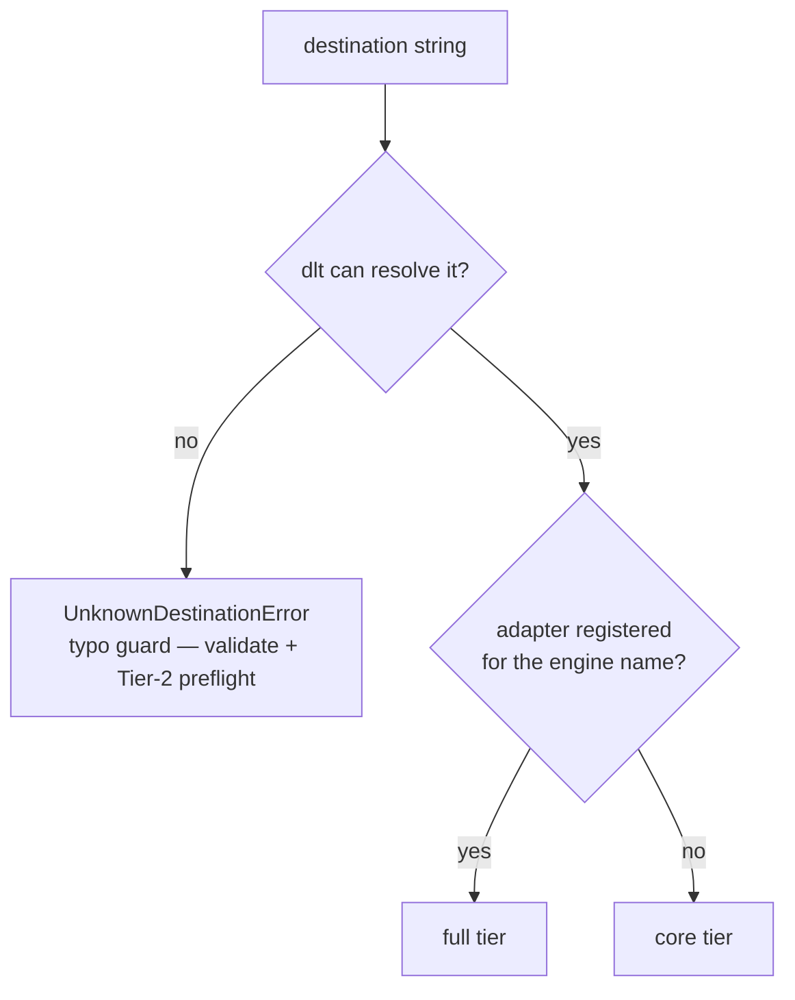

# Destinations and capability tiers

How `dlt-ops` decides what works against a given destination: any destination dlt can resolve runs the core pipeline, and a registered `DestinationAdapter` upgrades it to full tier, which unlocks the features that speak SQL to the destination directly. Read this before picking a destination — and before wondering why a feature refused to run against yours.

**At a glance**

| Mechanism | When it resolves | Full tier unlocks | On core tier | Canonical detail |
|---|---|---|---|---|
| A registry check on the destination's engine name → **core** (any destination dlt resolves) or **full** (a registered `DestinationAdapter`) | At `validate`, and again at run time, per destination | The six adapter-gated features (below) | Observability skips with an INFO line; a gate the config demands fails hard at preflight | [Feature × tier matrix](../reference/destinations.md) |

## The two tiers

**`dlt-ops` moves zero rows itself** — dlt owns the data write, and the core run loop (extract, pre-load assertions with `fail`/`warn`, schema contracts, normalize, load) works against **any destination dlt resolves**. That is **core tier**: discovery, `validate`, `run`, scheduling metadata, run-trace persistence, and `clean --local-only` all work there, with no dlt-ops plugin involved.

A subset of features has to speak SQL to the destination directly — insert a ledger row, persist a checkpoint mid-run, claim a backfill chunk, diff `information_schema` against your models. SQL needs a dialect, an identifier grammar, a placeholder style, and a live client, and those arrive through a `DestinationAdapter`. A destination with an adapter registered runs at **full tier**, which adds the six adapter-gated features:

- [runs ledger](runs-ledger.md) and `status`
- [checkpoints](checkpoints.md) (`@with_checkpoints`)
- [backfill](backfill.md) (chunk state in `_dlt_backfills`)
- `clean` (remote)
- [reconcile](reconciler.md)
- [assertion](assertions.md) quarantine

That list renders from one constant in the code — every preflight error, run-start warning, and refusal message names the same six features, so the runtime and the docs cannot drift on what full tier means. First-party adapters ship for **DuckDB**, **Postgres**, and **BigQuery**; any other engine reaches full tier the moment someone registers an adapter for it under the `dlt_ops.destination` entry-point group — see [write a destination adapter](../guides/write-a-destination-adapter.md). The [destinations reference](../reference/destinations.md) has the full feature × tier matrix and per-destination notes.

Every `run` prints the resolved tier in its configuration block before anything executes. The scaffolded demo project (`dlt-ops init demo --example`) points at DuckDB:

```text
Pipeline Configuration
----------------------------------------
  Source: demo_events
  Function: demo_events_source
  Resources: all (1 total)
  Destination: duckdb
  Dataset: demo_data (from .dlt/config.toml)
  Capabilities: full
```

Point the same source at a local `filesystem` bucket instead —

```toml
[dlt_ops]
default_destination = "filesystem"

[destination.filesystem]              # dlt-native config; dlt-ops adds nothing here
bucket_url = "file:///tmp/demo/_storage"
```

— and the run still loads, at core tier, with the degradation announced up front:

```text
  Destination: filesystem
  Capabilities: core (no adapter: runs ledger and status, checkpoints, backfill, clean (remote), reconcile, assertion quarantine unavailable)
```

```text
2026-07-16 17:50:56|[WARNING]|dlt_ops.discovery.runner|destination 'filesystem' has no registered DestinationAdapter — running in core mode; adapter-gated features unavailable: runs ledger and status, checkpoints, backfill, clean (remote), reconcile, assertion quarantine; extract/load, fail/warn assertions, and trace persistence run normally
2026-07-16 17:50:56|[INFO]|dlt_ops.runs.writer|runs ledger skipped: destination 'filesystem' has no DestinationAdapter (core mode)
1 load package(s) were loaded to destination filesystem and into dataset demo_data
```

The tier is per destination, not per install: one project can load into full-tier DuckDB and a core-tier object store side by side, and each source gets the tier of the destination it resolves to.

## How the tier resolves

**Tier is a registry-membership check on the destination's engine name — the adapter is never loaded to answer it.** Only the adapter's registration is consulted, at `validate` time and again at run time; a destination string resolves to full tier, core tier, or the typo guard.

Tier resolution — a registry check on the engine name, never a load of the adapter:



The engine name is `Destination.to_name(destination.destination_type)`, the one normalization every adapter lookup shares — so `duckdb` and `dlt.destinations.duckdb` land on the same registry entry, and a custom dlt `destination_name` changes config sections but never the tier. The adapter has to match the SQL dialect, and the dialect follows the engine.

Two consequences worth knowing:

- **Registration, not installation, decides the tier.** The first-party adapters register via entry points in the base distribution, so `duckdb`, `postgres`, and `bigquery` resolve to full tier even when the destination's own SDK extra is not installed — a missing SDK surfaces later, at client construction, with dlt's own error.
- **A typo is not a tier.** A destination dlt cannot resolve at all fails the typo guard before the tier question is asked, at Tier-2 preflight and at `validate`:

```text
dlt_ops.preflight.UnknownDestinationError: destination 'duckdbb' is not a dlt destination: Destination 'duckdbb' was first attempted to be resolved as a named destination with a configured type. However, no destination type was configured. ...
```

A registered adapter that fails to load, or is missing part of the `DestinationAdapter` Protocol surface, is also a hard failure — a present-but-broken adapter silently losing installed features would be worse than either tier.

## Degradation is loud; gates fail hard

**Core tier splits along the same asymmetry as the rest of the [failure-semantics contract](failure-semantics.md): observability goes quiet, gates refuse.**

**Observability goes quiet.** The runs ledger has nowhere to live on a core-tier destination, so both ledger writes skip with one INFO line each (shown above) — not an error, because nothing is broken. `status` reports the source as `ledger unsupported`, a state kept distinct from an outage. The `destination_capability` rule reports core mode as a `validate` warning: a plain `validate` still passes, `validate --strict` fails on it —

```text
⚠ 1 warning(s):
  [demo_events] destination: destination 'filesystem' has no registered DestinationAdapter — running in core mode; adapter-gated features unavailable: runs ledger and status, checkpoints, backfill, clean (remote), reconcile, assertion quarantine

✗ --strict: warnings treated as errors
```

**Gates refuse before any work.** A feature your config explicitly demands cannot silently downgrade: a run that engages `@with_checkpoints`, assertion `quarantine`, or backfill's chunk state on a core-tier destination is refused at Tier-2 preflight with a `DestinationCapabilityError` naming the engaged feature, and `reconcile` and remote `clean` refuse with a capability-specific message (`clean --local-only`, which never resolves the destination, keeps working). Teams that operate on the adapter-backed surfaces can make absence itself fatal:

```toml
[dlt_ops]
require_destination_adapter = true
```

```text
dlt_ops.preflight.DestinationCapabilityError: destination 'filesystem' has no registered DestinationAdapter, but this run engages adapter-gated feature(s): require_destination_adapter = true ([dlt_ops]). Features gated on an adapter: runs ledger and status, checkpoints, backfill, clean (remote), reconcile, assertion quarantine. Registered adapters: 'bigquery', 'duckdb', 'postgres'. Install a DestinationAdapter under the 'dlt_ops.destination' entry-point group, switch to a destination that has one, or remove the feature from the run; see docs/reference/destinations.md.
```

Degrade-by-default is deliberate: a scheduled run should not die because an observability table has nowhere to live. The knob inverts the default for projects where the ledger and checkpoints are load-bearing. `dlt-ops plugins doctor` shows which adapters are registered on the `destination` axis at any time.

## One canonical SQL dialect, one boundary

**Every adapter-gated feature is SQL against the destination**, so supporting N destinations × M features naively means N×M dialect-specific statements. `dlt-ops` refuses that matrix: all package code writes **canonical SQL in the DuckDB dialect** (DuckDB is the universal dev-loop destination) with positional `?` placeholders, and hands it to the adapter's `execute_sql` / `execute_query` together with the parameters. The adapter owns the entire translation as a single boundary call: transpile via [sqlglot](https://github.com/tobymao/sqlglot), convert placeholders to the destination's native style, execute through the live dlt `sql_client`. Callers never transpile, never pick placeholder styles, never touch a raw client — and a new adapter unlocks all six features for its destination at once, because they all emit the same canonical SQL.

The same checkpoint lookup, as three adapters execute it internally:

```text
duckdb     SELECT checkpoint_value FROM "demo_data"."_dlt_custom_checkpoints" WHERE pipeline_name = ? AND status = 'active' ORDER BY created_at DESC LIMIT 1
bigquery   SELECT checkpoint_value FROM `demo_data`.`_dlt_custom_checkpoints` WHERE pipeline_name = %s AND status = 'active' ORDER BY created_at DESC LIMIT 1
postgres   SELECT checkpoint_value FROM "demo_data"."_dlt_custom_checkpoints" WHERE pipeline_name = %s AND status = 'active' ORDER BY created_at DESC NULLS LAST LIMIT 1
```

Quoting, placeholder style, even ordering semantics (`NULLS LAST`) differ — none of it appears in caller code. Three details make the boundary hold:

- **Parameters bind at the AST level.** Placeholders are swapped as sqlglot AST nodes, never by string interpolation, so values cannot enter the SQL text and a quoting bug cannot reintroduce injection. The one exception is typed, not textual: BigQuery's DB-API cannot bind a `None`, so its adapter inlines `NULL` — as an AST node, still never interpolated text.
- **Fragments cover what transpile cannot.** sqlglot transpiles syntax, not every function idiom; interval arithmetic is the classic casualty. Each adapter therefore owns tiny canonical-dialect fragments (`timestamp_now_sql`, `timestamp_sub_days_sql(days)`) it guarantees survive its own transpile step, snapshot-locked in tests.
- **System-table DDL stays lowest-common-denominator.** The ledger, checkpoint, and backfill tables carry no `PARTITION BY` / `CLUSTER BY` — those clauses do not transpile, and the tables are small by design. Per-destination optimizations stay in per-destination helpers, opted into by the users who want them, never in shared DDL.

The `DestinationAdapter` Protocol (in `dlt_ops.destinations.protocol`) is the whole contract: the name/dialect, capability flags (`supports_if_exists`, `supports_create_schema_if_not_exists`, ...), identifier rendering with grammar validation, the two execute calls, and `fetch_columns` for the reconciler. Implementing it — the [adapter guide](../guides/write-a-destination-adapter.md) walks through a full one — is what "full tier" physically means.

## Where next

- [Destinations reference](../reference/destinations.md) — the feature × tier matrix, core tier verb by verb, object-store notes
- [Failure semantics](failure-semantics.md) — the full contract the tier split is one instance of
- [Write a destination adapter](../guides/write-a-destination-adapter.md) — take your engine to full tier
