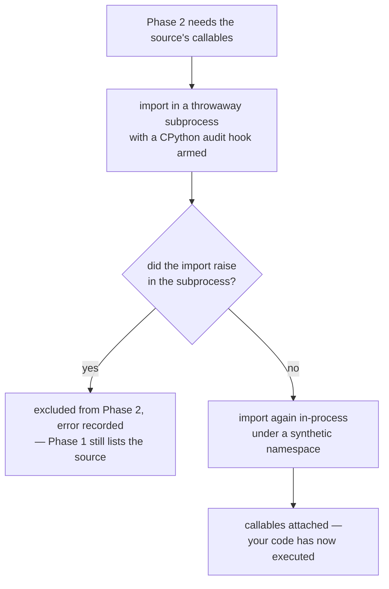

# Discovery

How `dlt-ops` finds your sources: a two-phase scan of the mandatory project layout — a pure AST pass that never imports your code, and a sandbox-checked import that attaches the callables the runtime needs. Read this to understand exactly when your code executes, and why "never at enumeration time" is a hard guarantee rather than an optimization.

There is no registration code in this model: a source exists because a correctly named module sits in a correctly named directory (the [project layout](../getting-started/project-layout.md) lists the conventions), and discovery is what turns that layout into runnable pipelines.

**At a glance**

| What it is | When your code runs | Phase 1 | Phase 2 | Failure mode |
|---|---|---|---|---|
| A two-phase scan of the mandatory layout — no registration code | Never at enumeration; only at `validate`/`run` (Phase 2), and only after the sandbox verdict | Pure `ast` parse, never imports — powers `list`, `resources`, `status`, and Airflow DAG parsing | A throwaway-subprocess import-safety check, then an in-process import gated on its verdict | Per-module isolation — a module that fails to parse or import is excluded with the error recorded and surfaced by `validate`; siblings are unaffected |

## Phase 1 — the pure AST scan

**Phase 1 parses candidate modules with Python's `ast` module and never imports them.** Two things, and only these two, decide whether a directory directly under the project root is a pipeline: its name must not start with `.` or `_`, and it must hold a `source/` subdirectory containing at least one non-underscore `.py` file. **No directory is excluded by name** — a pipeline directory called `common` or `logs` is as discoverable as any other. (`.dlt` and `__pycache__` need no special case; the prefix rule already covers them.) Every `source/*.py` module in a qualifying pipeline is then scanned for top-level functions decorated `@dlt.source`.

Every directory Phase 1 rejects is logged at DEBUG with the reason it was rejected — no `source/`, a `source/` holding only underscore-prefixed files, a leading `.` or `_`. A directory an operator believes is a pipeline and that is silently missing from `pipeline list` is the hardest discovery failure to diagnose, and this is the only place that knows why, so raise the log level before guessing.

Each discovered source is keyed by its config section: the explicit `@dlt.source(name="<X>")` value, or the function name minus its `_source` suffix as the fallback (`validate` requires the explicit form — the `explicit_source_name` rule). Alongside the source function, the scan collects statically:

- **Resources** — the union of `@dlt.resource` declarations anywhere in the source's own module (including functions defined inside other functions, an idiomatic dlt pattern) and declarations in the pipeline's shared `resource/*.py` modules.
- **Checkpoint usage** — a name match on decorators whose terminal name is `with_checkpoints`, across the same files. This flag feeds the capability checks in [validation](validation.md) and the tier model in [destinations and tiers](destinations-and-tiers.md).
- **Config** — the `[sources.<X>]` section of `.dlt/config.toml`, including the required `schedule`.

A static scan is an approximation, and the package is explicit about where it stops: resources built dynamically (loops, factories) or imported from outside the pipeline directory only appear after Phase 2, and an aliased import (`from dlt_ops import with_checkpoints as wc`) escapes the checkpoint name match. Phase 1 trades completeness for the guarantee that parsing your files can never execute them.

The enumeration surfaces run Phase 1 only. `pipeline list`, `pipeline resources`, and `pipeline status` never import project code, and neither does the Airflow DAG factory at scheduler-parse time:

```bash
dlt-ops pipeline list
```

```text
Found 1 source(s)

Name                           Pipeline        Schedule   Resources
----------------------------------------------------------------------
demo_events                    my_pipeline     @daily     1
```

```bash
dlt-ops pipeline resources -s demo_events
```

```text
Source: demo_events
Pipeline: my_pipeline
Function: demo_events_source
Config: [sources.demo_events]
Schedule: @daily

Resources (1):
  • events
```

Resource counts and lists on these surfaces come from the static approximation; `validate` and `run` resolve the live list.

## Phase 2 — sandbox-checked import

**Phase 2 imports each source module to attach the callables the runtime needs — in two deliberately separate steps, the first a throwaway subprocess whose crash can never contaminate the calling process.**

A throwaway subprocess runs the import behind an audit hook first, and only a source that imported cleanly there is re-imported in-process to attach its callables:



1. **Import-safety check in a throwaway subprocess.** The child process installs a CPython audit hook (`sys.addaudithook`) before executing the module, records violations, and reports them plus any import exception back as JSON. It runs in a subprocess because audit hooks are process-global and irremovable — the check must not contaminate the calling process. The child times out after 30 seconds, runs with `python -B` so bytecode-cache writes are not misread as disk writes, and imports dlt (and warms up its decorator machinery) *before* arming the hook, so dlt's own import-time file access is never attributed to your module.
2. **In-process import to attach the source function.** Callables cannot cross a process boundary, so the module is imported again in the calling process — under a synthetic package namespace scoped to the project tree (no `sys.path` mutation, and intra-pipeline relative imports like `from ..resource.events import events` keep working). It runs only after the subprocess verdict: a module whose import raised in the child is excluded with a recorded error, never imported in-process.

The audit hook flags four kinds of import-time behavior:

- **Network** — socket connect/bind/DNS and `urllib` requests; the *attempt* is the violation, a refused connection still counts.
- **Disk writes** — any `open` requesting write access, plus mkdir/rename/remove and friends; disk *reads* are permitted.
- **Pipeline runs** — `dlt.pipeline(...)` constructed at import time.
- **Process spawns** — a spawned process escapes the hook entirely, so spawning one is itself a finding.

Known gaps, stated plainly: C extensions doing raw syscalls bypass CPython audit events, `os.write` on an inherited file descriptor has no event, and whatever a spawned subprocess does is invisible — only the spawn is flagged.

Be clear about what the sandbox does and does not block. The audit hook **observes**; it does not prevent. The child process really does execute the module's import, side effects and all — that is how the findings are produced — so a module that phones home at import time phones home once, from a process built to be thrown away. What the sandbox buys is that it happens exactly there: a module with violations is then **withheld from the in-process import**, so those side effects do not run again in the parent. `validate` reports the violation as an error, and `run` and `backfill` refuse the source rather than importing it.

The project-wide `[dlt_ops.rules] import_safety = false` knob turns the whole mechanism off: no subprocess, and the module is imported in-process as it would have been otherwise. That is the supported way to run a source whose import-time I/O you have accepted.

## Why: the orchestrator-parse foot-gun

**The two-phase split exists because of one recurring production incident.** A source module acquires a module-level side effect — the classic is fetching config at import:

```python
import requests

try:
    FEATURE_FLAGS = requests.get("http://127.0.0.1:9/flags", timeout=0.2).json()
except Exception:
    FEATURE_FLAGS = {}
```

This works fine locally, and then an orchestrator starts parsing the file on every scheduler heartbeat — and the request fires on every parse, forever, from a process you never think about. `dlt-ops` closes the gap from both ends: enumeration (including the Airflow DAG factory's parse path) uses Phase 1 and structurally cannot execute the module, and `validate` fails the project before deploy — even the guarded, refused connection attempt above is caught:

```bash
dlt-ops pipeline validate
```

```text
Validating sources
Source 'demo_events' excluded from Phase 2: not imported — violates import safety (Rule 15) at import time: network (socket.getaddrinfo: 127.0.0.1:9), network (socket.connect: ('127.0.0.1', 9)). Fix the module or opt out via [dlt_ops.rules] import_safety = false.

✗ 4 error(s):
  [demo_events] import: source module demo_events.py: not imported — violates import safety (Rule 15) at import time: network (socket.getaddrinfo: 127.0.0.1:9), network (socket.connect: ('127.0.0.1', 9)). Fix the module or opt out via [dlt_ops.rules] import_safety = false.
  [demo_events] validation_coverage: reduced rule coverage: source 'demo_events' failed Phase-2 introspection, so it is absent from the introspected source set every source-inspecting rule iterates — those rules did not run for it. Its config, schema, resource and assertion findings are unknown, not clean. Fix the 'import' finding reported for this source to restore full coverage.
  [demo_events] import_safety: Rule 15: network at import of demo_events.py — socket.getaddrinfo(127.0.0.1:9)
  [demo_events] import_safety: Rule 15: network at import of demo_events.py — socket.connect(('127.0.0.1', 9))
```

(The `Rule 15` prefix is the convention's historical number; the rule ID that knobs and exemptions key on is `import_safety`.) The fix is always the same shape: move the side effect inside the source or resource function, where it runs when the pipeline runs — not when the file is parsed or imported.

Note what the audit hook does *not* report here. The `import requests` line is a library initialising itself, and one of the things urllib3 does during its own import is bind an IPv6 socket. Attribution walks out from each event to the first module body on the stack, so that bind is attributed to urllib3 and never appears as a finding against `demo_events.py` — only the two calls the project's own module body made do. The `validation_coverage` line is an always-on finding of its own: a source excluded from Phase 2 is invisible to every rule that iterates sources, so `validate` states the coverage that exclusion cost rather than letting "no findings" read the same as "never checked".

## Failure behavior

**Discovery isolates failures per module, and Phase 1 keeps listing what Phase 2 cannot load:**

- **Broken `.dlt/config.toml`** — a loud parse error. A broken project marker never silently widens the root search or degrades to defaults.
- **A module that fails to parse** — excluded from discovery so sibling modules are unaffected, and reported by `validate` as an error that exits non-zero. It is not quietly dropped: a source file nobody can parse is a source that cannot run.
- **A module that raises at import** — excluded from Phase 2 with the error recorded. `pipeline list` still shows it (the AST scan needs no import), and `validate` reports it as an always-on error with no rule ID — a source that cannot import cannot run, so there is no knob to silence it. A second always-on error follows it, naming what the exclusion cost: every rule that iterates sources skipped this one, so its config, schema and assertion findings are unknown rather than clean. With a module-level `os.environ["DEMO_EVENTS_API_KEY"]` and the variable unset:

    ```text
    $ dlt-ops pipeline validate
    Validating sources
    Source 'demo_events' excluded from Phase 2: module raised at import: KeyError: 'DEMO_EVENTS_API_KEY'

    ✗ 2 error(s):
      [demo_events] import: source module demo_events.py: module raised at import: KeyError: 'DEMO_EVENTS_API_KEY'
      [demo_events] validation_coverage: reduced rule coverage: source 'demo_events' failed Phase-2 introspection, so it is absent from the introspected source set every source-inspecting rule iterates — those rules did not run for it. Its config, schema, resource and assertion findings are unknown, not clean. Fix the 'import' finding reported for this source to restore full coverage.
    ```

- **A sandbox child that crashes or times out** — the module counts as unverified and is not imported; the error is recorded and surfaced the same way.
- **Two sources resolving to the same config section** — a warning; the later-scanned one overwrites the earlier. Source names are identities, so treat this warning as a bug in your layout, not as a merge feature.

## Where next

- [Validation](validation.md) — the rule framework that consumes discovery output
- [Project layout](../getting-started/project-layout.md) — the conventions that make scanning possible
- [Scheduling and orchestration](scheduling-and-orchestration.md) — how orchestrator adapters build DAGs from Phase-1 output
