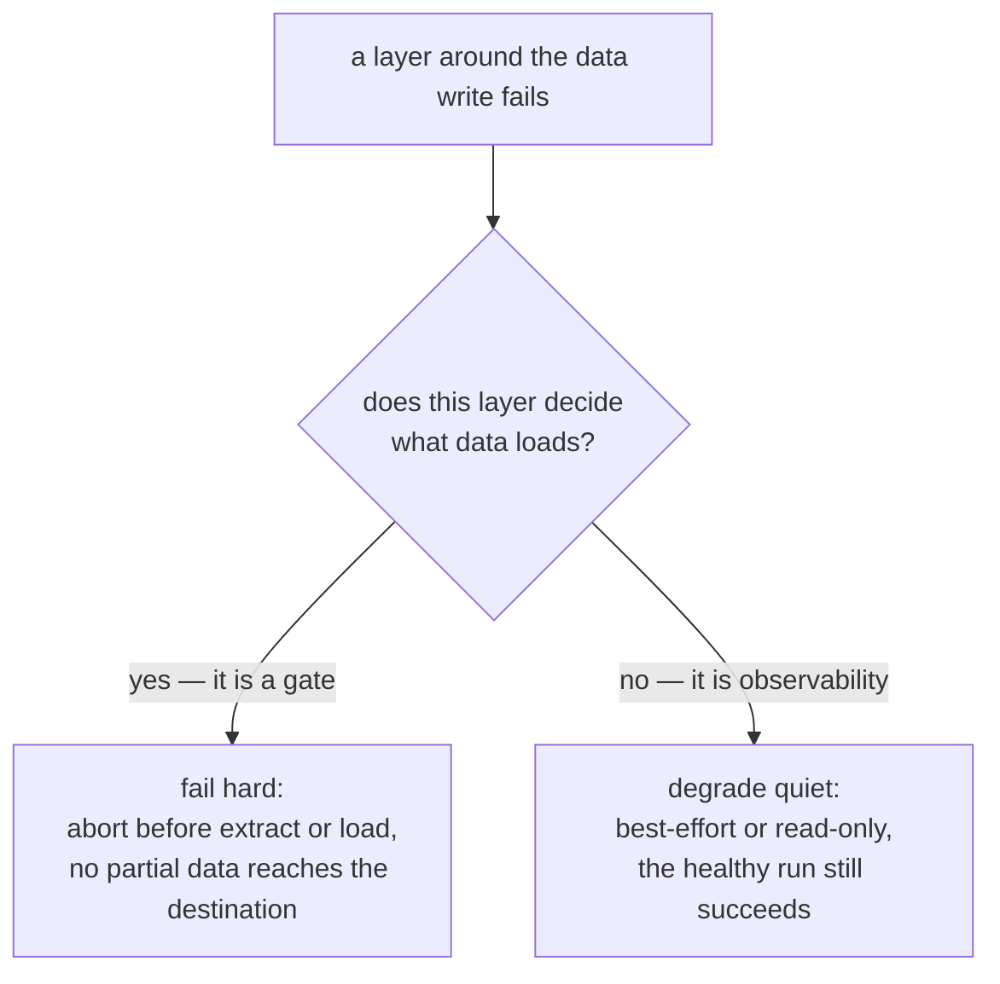

# Failure semantics

What `run` and `backfill` do when each layer around the data write fails. The contract is asymmetric on purpose: **gates that decide what data loads fail hard; observability that merely records what happened never takes a healthy run down with it.** Read this before wiring the toolchain into a scheduler — every behavior below is what your orchestrator will see.

The same asymmetry resolves [capability tiers](destinations-and-tiers.md): a feature the config demands (checkpoints, quarantine, backfill) fails hard at preflight when the destination has no `DestinationAdapter`, while observability (the runs ledger, trace persistence) simply goes quiet.

**At a glance**

| | |
|---|---|
| What it is | What `run`/`backfill` do when a layer around the data write fails |
| The asymmetry | Gates that decide *what data loads* fail hard; observability that merely *records what happened* never takes a healthy run down |
| Fails hard | Tier-2 preflight and `fail` assertions abort before extract/load; adapter-gated features refuse on a core-tier destination |
| Degrades quiet | `warn` assertions, the runs ledger, trace persistence, `status`, and the reconciler — logged, best-effort, or read-only, never fatal |
| Canonical | The contract table below (canonical repo-wide); [capability tiers](destinations-and-tiers.md) is one instance of the split |

## The contract

**The table below is the canonical failure contract — one defined behavior per layer around the data write, expanded row by row through the rest of this page.**

| Layer | On failure |
|---|---|
| Tier-2 preflight | **Aborts before extract.** A violated precondition (unknown rule/assertion reference, unresolvable or typo'd destination, an adapter-gated feature engaged on a core-tier destination, backfill bounds on cursor-less resources) never reaches your source code. |
| Assertions — `fail` | **Aborts before load.** The extracted package is dropped; it is never auto-loaded by a later run. |
| Assertions — `quarantine` | **Full tier only.** On a core-tier destination a resource configured for `quarantine` is refused at preflight, before extract — a gate the config demands cannot silently downgrade. At full tier: failing rows are removed from the load and written to `_dlt_rejected`; a failed quarantine *write* **aborts the run** (rows already left the stream, and dropping them unrecorded would be silent data loss). |
| Assertions — `warn` | Never aborts. Violations are logged and counted; the load proceeds. |
| The data write | dlt's own outcome is the run's outcome. |
| Runs ledger (`_dlt_ops_runs`) | **Best-effort.** A ledger write failure is logged loudly but never fails a data run — the ledger is observability, not a transaction log; a run whose ledger write failed is a real run with no status row. On a **core-tier** destination (no `DestinationAdapter`) the ledger has nowhere to live: both writes skip with one INFO line — not an error. |
| Run-trace persistence | Best-effort, same policy as the ledger (works at both tiers). |
| Adapter-gated verbs on a core-tier destination (`backfill`, remote `clean`, `reconcile`, `@with_checkpoints`) | **Refused before any work** with a `DestinationCapabilityError` naming the feature — at preflight for `run`/`backfill`, and flagged by `validate`. `clean --local-only` is unaffected. Register a `DestinationAdapter` (full tier) or remove the feature. |
| Reconciler and `status` | Read-only diagnostics: they never mutate pipeline state and never block runs. `status` reports a ledger it cannot reach as `ledger unreadable` (an outage), a source that never ran as `no runs recorded`, and a core-tier destination that cannot carry a ledger as `ledger unsupported` — three distinct absence states. |

The one question the contract answers for every layer — does it decide what data loads, or only record what happened:



The rest of this page expands each row against a scaffolded demo project (`dlt-ops init demo --example`, DuckDB destination unless stated otherwise).

## Gates fail hard

**A gate decides what data loads, so a gate that trips aborts the run before data can reach the destination — at preflight (before extract) or at an assertion boundary (before load).**

### Tier-2 preflight: abort before extract

**Every `run` and `backfill` re-checks a narrow set of critical preconditions at runtime** — [validation](validation.md) lists the five conditions and why the runtime never trusts that `validate` ran. A preflight failure raises a typed error before any pipeline is constructed: nothing is extracted, nothing is loaded, and there is no partial state to clean up. The refusals are worded as instructions, not stack noise — here the demo project's `events` resource declares no incremental cursor, so injected backfill bounds would be silently ignored and every chunk would re-extract everything:

```bash
dlt-ops pipeline backfill demo_events --from 2026-01-01T00:00:00Z --to 2026-01-02T00:00:00Z --chunk 6h
```

```text
Error: backfill bounds were supplied but resource(s) without an incremental cursor are selected: events. Declare a dlt.sources.incremental cursor or deselect them.
```

That refusal is the contract working: the alternative — a "backfill" that quietly re-extracts the full history per chunk — looks like success and is worse than any error.

### Assertions with `on_failure = "fail"`: abort before load

**`fail` is the default policy for [pre-load assertions](assertions.md).** When a gate trips, the run stops between extract and load — the destination never sees the batch. With `min_rows_per_load = 10` configured against the example's 6-row resource:

```text
2026-07-16 17:07:14|[INFO]|dlt_ops.discovery.runner|Dropped pending load package(s) after assertion failure
dlt_ops.assertions.models.AssertionFailedError: assertion 'min_rows_per_load' failed on demo_events.events: row count 6 is below min_rows_per_load 10
```

The `Dropped pending load package(s)` line is load-bearing failure hygiene: dlt persists the extracted package in the pipeline's working directory, and the *next* run would auto-load it — silently defeating the assertion. The runner deletes the rejected package as part of failing, so an aborted gate cannot leak its data into a later, healthy run. The failure is still a recorded fact, not a silent one — the [runs ledger](runs-ledger.md) keeps the outcome with its one-line error summary:

```bash
dlt-ops pipeline status
```

```text
Source: demo_events
  Status     Started              Completed            Records   Trigger    Resource        Run ID
  failed     2026-07-16 15:07:14  2026-07-16 15:07:14  -         cli        -               3ed1b0a1dabf
    ✗ AssertionFailedError: assertion 'min_rows_per_load' failed on demo_events.events: row count 6 is below min_rows_per_load 10
  completed  2026-07-16 15:06:59  2026-07-16 15:07:00  6         cli        -               ffe017b65b33
```

### Assertions with `on_failure = "quarantine"`: full tier only, and a failed write aborts

**Quarantine removes just the failing rows from the load and records them in a `_dlt_rejected` table** — which requires a destination the toolchain can write SQL against, i.e. a registered `DestinationAdapter`. On a core-tier destination the run is refused at preflight, before extract, because a gate the config demands cannot silently downgrade to "load the bad rows anyway." With `unique_columns = { value = ["id"], on_failure = "quarantine" }` configured and the source pointed at a local `filesystem` destination:

```text
dlt_ops.preflight.DestinationCapabilityError: destination 'filesystem' has no registered DestinationAdapter, but this run engages adapter-gated feature(s): assertion quarantine (on_failure = "quarantine" on resource(s): events). Features gated on an adapter: runs ledger and status, checkpoints, backfill, clean (remote), reconcile, assertion quarantine. Registered adapters: 'bigquery', 'duckdb', 'postgres'. Install a DestinationAdapter under the 'dlt_ops.destination' entry-point group, switch to a destination that has one, or remove the feature from the run; see docs/reference/destinations.md.
```

`validate` flags the same configuration statically (the `destination_capability` rule), so the mismatch is caught in CI before a scheduler ever hits the preflight. At full tier the same config works: back on DuckDB, with a duplicate `id` injected into the fixture data, the run completes and only the offending row is diverted —

```text
2026-07-16 17:11:03|[INFO]|dlt_ops.discovery.runner|Quarantined 1 row(s) to _dlt_rejected
1 load package(s) were loaded to destination duckdb and into dataset demo_data
```

— leaving 6 rows in `demo_data.events` and one row in `demo_data._dlt_rejected` carrying full context: `pipeline_name`, `source_section`, `resource_name`, `run_id` (joinable to the ledger), `assertion_type` (`unique_columns`), `assertion_params`, `violation` (`duplicate key id=6`), `rejected_at`, and the complete `row_json`. One deliberate exception to "observability never aborts" lives here: if the quarantine *write* itself fails, the run aborts with a `QuarantineWriteError`. The rows were already removed from the stream — letting the run succeed would mean data vanished with no record anywhere, which is exactly the silent loss the gate exists to prevent.

### Adapter-gated verbs on a core-tier destination: refused before any work

**`backfill` and `@with_checkpoints` refuse through the Tier-2 preflight shown above** (a `DestinationCapabilityError` naming the engaged feature). Verbs that open the destination outside a run — `reconcile`, remote `clean` — refuse at the destination boundary with the same core-mode message; every refusal renders from one shared notice, so the feature list can never drift between surfaces:

```bash
dlt-ops pipeline reconcile -s demo_events --dry-run
```

```text
Source: demo_events  |  Findings: 0  |  Duration: 0.32s
  ✗ Reconciler error: failed to open destination 'filesystem': pipeline 'demo_events_pipeline': destination 'filesystem' has no registered DestinationAdapter — running in core mode; adapter-gated features unavailable: runs ledger and status, checkpoints, backfill, clean (remote), reconcile, assertion quarantine. Registered adapters: 'bigquery', 'duckdb', 'postgres'. ...
```

`clean --local-only` is unaffected — it touches only the local pipeline working state, which needs no adapter. The remedies are always the two named in the message: register a `DestinationAdapter` (reaching full tier) or remove the feature from the run.

## The data write

**The write itself is dlt's: `dlt-ops` stages the steps around it but does not reinterpret the outcome.** If dlt loads the package, the run succeeded; if dlt raises, the run failed with dlt's error, and the ledger records it. dlt's native recovery semantics apply unchanged — a package that failed at the load step stays pending in the pipeline working directory and is retried by the next run (dlt's behavior, and the right one: the data passed every gate; only the write faltered). Contrast that with the assertion path above, where the pending package is deliberately dropped because the data itself was rejected. A resource using [`@with_checkpoints`](checkpoints.md) adds one asymmetry to this native recovery: a failure *during extract* resumes from the last checkpoint and never reclaims the rows it extracted but never loaded below that point — a deliberately lossy trade whose recovery path is a windowed backfill, not dlt's load-step retry.

## Observability never kills a run

**Observability records what happened; a failure in it logs loudly and the run still succeeds — it never takes a healthy run down.**

### Assertions with `on_failure = "warn"`

**`warn` converts a gate into observability: violations are logged and counted, and the load proceeds.** The same 6-row resource with `on_failure = "warn"` and `min_rows_per_load = 10` loads normally and exits 0:

```text
2026-07-16 17:08:17|[WARNING]|dlt_ops.assertions.engine|assertion 'min_rows_per_load' warn on demo_events.events: row count 6 is below min_rows_per_load 10
2026-07-16 17:08:17|[WARNING]|dlt_ops.assertions.engine|assertion warn summary for demo_events.events: min_rows_per_load=1
```

### The runs ledger

**Ledger writes are best-effort by policy**: the data landing is the priority, and a run that loaded correctly must never be failed retroactively by its own bookkeeping. A write failure on a full-tier destination is logged at ERROR (`Failed to write run-start row to _dlt_ops_runs (non-fatal, run continues)`) and swallowed — the run is real, it just has no status row (or, when only the terminal write failed, a row frozen at `running`). On a core-tier destination this is not even a failure: the ledger has nowhere to live, so both writes skip with one INFO line each, and the run itself proceeds normally. A run against the local `filesystem` destination:

```text
2026-07-16 17:09:23|[WARNING]|dlt_ops.discovery.runner|destination 'filesystem' has no registered DestinationAdapter — running in core mode; adapter-gated features unavailable: runs ledger and status, checkpoints, backfill, clean (remote), reconcile, assertion quarantine; extract/load, fail/warn assertions, and trace persistence run normally
2026-07-16 17:09:23|[INFO]|dlt_ops.runs.writer|runs ledger skipped: destination 'filesystem' has no DestinationAdapter (core mode)
1 load package(s) were loaded to destination filesystem and into dataset demo_data
```

Degradation is loud but proportionate: one WARNING at run start names everything going dark, each skipped ledger write logs one INFO line, and ERROR stays reserved for real write failures. The ledger is the only adapter-gated feature that skips quietly — the other five refuse, at preflight or at the destination boundary. [Runs ledger](runs-ledger.md) covers the data model.

### Run-trace persistence

**dlt's run trace is persisted to a `_dlt_trace` table in the run's own destination and dataset under the same best-effort policy**: a failure logs `Failed to persist trace (non-fatal)` and the run continues. Unlike the ledger it works at both tiers — the trace loads through a plain dlt pipeline rather than adapter SQL, so the core-tier `filesystem` run above still ends with `Trace persisted to _dlt_trace`.

### Reconciler and `status`: read-only diagnostics

**The [reconciler](reconciler.md) and `pipeline status` never mutate pipeline state and never block runs** — they only read and report. Their honesty obligation runs the other way: absence must be diagnosable. `status` distinguishes three states that a lazier tool would collapse into one empty listing — a source that never ran (`no runs recorded`), a ledger the CLI cannot reach, with the reason (`ledger unreadable` — an outage, not an empty history), and a destination that cannot carry a ledger at all (`ledger unsupported` — a capability gap, not an outage). The core-tier project from above, read back:

```bash
dlt-ops pipeline status
```

```text
Source: demo_events
  ! ledger unsupported: destination 'filesystem' has no DestinationAdapter (core mode)
```

and a freshly scaffolded project that has never run:

```text
Source: demo_events
  no runs recorded
```

## Where next

- [Destinations and tiers](destinations-and-tiers.md) — how a destination resolves to core or full tier, and the feature × tier matrix
- [Assertions](assertions.md) — the gate execution model between extract and load
- [Runs ledger](runs-ledger.md) — the `_dlt_ops_runs` data model and how `status` reads it
