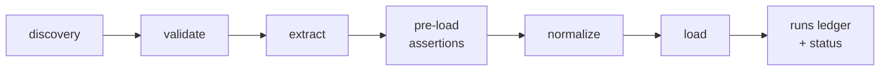

# dlt-ops

**An opinionated project layout and toolchain for [dlt](https://dlthub.com) pipelines — start structured, stay structured.**

`dlt-ops` wraps dlt the way dbt wrapped SQL: the primitive stays in charge of the core job (moving data), the wrapper decides how a project is laid out, validated, scheduled, and operated day to day. You keep writing plain `@dlt.source` / `@dlt.resource` code; the toolchain finds it by scanning a mandatory layout, checks it statically before anything runs, and adds the operational verbs dlt leaves to you.

**At a glance**

| dlt-ops is | dlt-ops is not |
|---|---|
| An opinionated project layout + operational toolchain for dlt: discovery, validation, scheduling metadata, and the operational verbs dlt leaves to you. | A connector framework — it moves zero rows itself (dlt owns the write). |
| For the common case: scheduled batch ingestion into a warehouse, lake, or local engine at moderate volume. | A replacement for dlt, Airbyte, or Meltano; or an orchestrator (it feeds one). |
| Guardrails and ergonomics around plain dlt — you keep writing `@dlt.source` / `@dlt.resource`. | A throughput layer — nothing here makes dlt faster; high-load, hard-SLA pipelines want purpose-built infrastructure. |

The shape of a dlt-ops run — discovery and validation gate it, the core loop (extract → assertions → normalize → load) moves the data, and the ledger records the outcome:

## The gaps it fills

dlt is the best open-source ingestion primitive available, and deliberately unopinionated — which is exactly what makes a dlt codebase hard to keep consistent once it grows past one person and one script:

- **Config sprawl** — environment variables can override almost anything from anywhere, so a pipeline's effective configuration depends on the machine it runs on.
- **No enforced layout** — every project invents its own structure; discovery, tooling, and review conventions get rebuilt each time.
- **No selective state cleanup** — removing one resource's data *and* its incremental state from a live destination has no supported path.
- **No runs ledger** — dlt tells you what the last run on this machine did; nothing records what ran, when, and with what outcome where the data actually lands.
- **Import-time foot-guns** — a module-level `requests.get(...)` works fine locally, then fires on every scheduler heartbeat once an orchestrator parses the file.
- **Silent schema drift** — columns appearing in (or going dark in) the destination behind your model's back go unnoticed until a consumer breaks.

`dlt-ops` does not replace dlt — it wraps your sources in a strict layout, static validation, and a runtime that fails fast instead of degrading silently.

## What you get

Every capability links to its concept page; the **Tier** column is the minimum destination tier it needs ([core or full](concepts/destinations-and-tiers.md)).

| Capability | Command | Tier | What it does |
|---|---|---|---|
| [Filesystem discovery](concepts/discovery.md) | — (automatic) | core | Sources are found by scanning the mandatory layout, not by registration code. Phase 1 is a pure AST scan that never imports your code; Phase 2 imports it inside a sandbox. |
| [Static validation](concepts/validation.md) | `validate` | core | 19 core rules (plus plugin-owned ones) over layout, naming, config, schedules, schema contracts, column typing, assertion config, destination capability, and import safety; `run`/`backfill` re-check critical preconditions at runtime. |
| [Scheduling metadata](concepts/scheduling-and-orchestration.md) | `schedule` in TOML | core | Every source declares a `schedule`; orchestrator adapters (Airflow first) turn discovery output into DAGs. |
| [Checkpoints](concepts/checkpoints.md) | `@with_checkpoints` | full | Persists pagination progress to the destination mid-run; a failed run resumes from the last checkpoint instead of the window start. |
| [Chunked backfill](concepts/backfill.md) | `backfill` | full | Splits a window into resumable chunks with per-chunk state; re-running skips completed chunks. |
| [Selective cleanup](guides/cleanup.md) | `clean` | core / full | Removes one resource's tables, incremental state, and checkpoints (or a whole source) from the live destination, surgically. `clean --local-only` is core; remote clean is full. |
| [Runs ledger](concepts/runs-ledger.md) | `status` | full | Every run and backfill writes start and outcome rows to a `_dlt_ops_runs` table in the destination; `status` reads it back. |
| [Schema-drift reconciler](concepts/reconciler.md) | `reconcile` | full | Diffs the live destination schema against your declared Pydantic models and routes findings to pluggable alert sinks. |
| [Pre-load assertions](concepts/assertions.md) | TOML + `run` | core / full | Per-resource data-quality gates enforced between extract and load: fail the run, `warn`, or `quarantine` bad rows to `_dlt_rejected` — bad data never loads by default. Quarantine is full tier. |
| [Capability tiers](concepts/destinations-and-tiers.md) | — (automatic) | core / full | Every destination dlt can resolve runs the core loop; a registered `DestinationAdapter` upgrades it to full tier, which unlocks the six adapter-gated features. Degradation is loud, never silent. |
| [Plugins](concepts/plugins.md) | `plugins` | — | Destinations, orchestrators, validators, secret backends, alert sinks, and assertion types all extend through one entry-points mechanism; no blessing required. |
| [Asymmetric failure semantics](concepts/failure-semantics.md) | — | — | Gates that decide what data loads fail hard; observability that merely records what happened never takes a healthy run down with it. |

## Status: 0.x

`dlt-ops` is pre-1.0: the API and plugin surface are still settling, and 0.x minor releases may break them — the [versioning policy](reference/versioning.md) defines the public API and the deprecation rules. The dlt dependency is a floor (`dlt>=1.27`), never a cap: you own your project's dlt version, and the [compatibility matrix](reference/compatibility.md) records what CI proves, not what is allowed.

## Where next

- [Installation](getting-started/installation.md) — the install matrix and what each extra unlocks
- [Quickstart](getting-started/quickstart.md) — scaffold, validate, run, and tour the operational features, fully offline
- [Project layout](getting-started/project-layout.md) — the nine conventions and why the layout is mandatory
