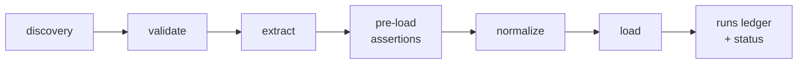

# dlt-ops

**A ready-made structure, toolchain, and set of guides for running many [dlt](https://dlthub.com) sources in production.**

Adopt a worked-out layout, scheduling contract, validation and observability story instead of designing one per project. `dlt-ops` wraps dlt the way dbt wrapped SQL: the primitive stays in charge of the core job (moving data), the wrapper decides how a project is laid out, validated, gated, scheduled, and operated day to day. You keep writing plain `@dlt.source` / `@dlt.resource` code; the toolchain finds it by scanning a mandatory layout, checks it statically before anything runs, gates the data before it lands, and records what happened where the data landed.

**At a glance**

| dlt-ops is | dlt-ops is not |
|---|---|
| An enforced layout, static validation, and pre-load data-quality gates for dlt, plus the operational surface a production project needs: scheduling metadata, checkpoints, backfill, a runs ledger, drift reconciliation. | A connector framework — it ships no connectors, and dlt owns the ingest write path (quarantine is the one place dlt-ops writes your rows itself). |
| For the common case: scheduled batch ingestion into a warehouse, lake, or local engine at moderate volume. | A replacement for dlt, Airbyte, or Meltano; or an orchestrator (it feeds one). |
| Guardrails and ergonomics around plain dlt — you keep writing `@dlt.source` / `@dlt.resource`. | A throughput layer — nothing here makes dlt faster; high-load, hard-SLA pipelines want purpose-built infrastructure. |

The shape of a dlt-ops run — discovery and validation gate it, the core loop (extract → assertions → normalize → load) moves the data, and the ledger records the outcome:

## The decisions it makes for you

dlt is an excellent ingestion primitive, and deliberately unopinionated — it moves data and leaves the surrounding shape to you. Running one source that way is a script. Running twenty of them on a schedule, across a team, turns that freedom into a set of design decisions: where source code lives, what a reviewer checks, what has to be true before a run may start, what data is allowed to land, and where you look afterwards to find out what happened. Every team answers those, usually more than once. `dlt-ops` answers them once, one way, and ships the tooling that holds the answer in place:

- **What data is allowed to land** — pre-load assertions declared in TOML run between extract and load: row-count floors and ceilings, required columns, in-batch uniqueness, custom predicates. A violating load fails, warns, or has its bad rows diverted into a `_dlt_rejected` table you can query. dlt's per-row Pydantic validation and schema contracts judge a row's *shape*; assertions judge a load's *content*, and the two compose.
- **What a project looks like** — one mandatory layout, so discovery is a filesystem scan rather than registration code and every source in every repo reads the same way. New sources arrive by convention instead of by wiring.
- **What must be true before a run starts** — a rule framework checks layout, naming, config, schedules, schema contracts, column typing, and assertion config in CI, and the runtime re-checks the critical subset on every run, because a production scheduler does not run your CLI steps first.
- **What importing your code is allowed to do** — source modules are imported in a sandbox that fails on network I/O or disk writes at import time, so a module-level `requests.get(...)` is caught before it can fire on every scheduler heartbeat that parses the file.
- **How you find out what happened** — every run writes a row to a `_dlt_ops_runs` table beside the data, opened at start and closed with its outcome, and `pipeline status` reads it back. Schema drift is reconciled in both directions: columns that appeared, and columns your model still declares that quietly stopped carrying data.
- **How it gets scheduled** — every source declares a schedule in TOML and orchestrator adapters turn discovery output into DAGs, so the scheduling contract lives with the source rather than in a separate repo.

`dlt-ops` does not replace dlt. Your sources stay plain `@dlt.source` code; this is the structure, toolchain, and guides around them.

## What you get

Every capability links to its concept page; the **Tier** column is the minimum destination tier it needs ([core or full](concepts/destinations-and-tiers.md)).

| Capability | Command | Tier | What it does |
|---|---|---|---|
| [Pre-load assertions](concepts/assertions.md) | TOML + `run` | core / full | Per-resource data-quality gates enforced between extract and load: row-count floors and ceilings, required columns, in-batch uniqueness, custom predicates. Fail the run, `warn`, or `quarantine` bad rows to `_dlt_rejected` — bad data never loads by default. Quarantine is full tier. |
| [Static validation](concepts/validation.md) | `validate` | core | 21 core rules (plus plugin-owned ones) over layout, naming, config, schedules, schema contracts, column typing, assertion config, destination capability, and import safety; `run`/`backfill` re-check critical preconditions at runtime. |
| [Filesystem discovery](concepts/discovery.md) | — (automatic) | core | Sources are found by scanning the mandatory layout, not by registration code. Phase 1 is a pure AST scan that never imports your code; Phase 2 imports it inside a sandbox that fails on import-time network I/O or disk writes. |
| [Schema-drift reconciler](concepts/reconciler.md) | `reconcile` | full | Diffs the live destination schema against your declared Pydantic models in both directions — columns that appeared behind your model's back, and (with `--include-removal`) model columns whose data went dark — and routes findings to pluggable alert sinks. |
| [Checkpoints](concepts/checkpoints.md) | `@with_checkpoints` | full | Persists pagination progress to the destination mid-run; a failed run resumes from the last checkpoint instead of the window start. |
| [Chunked backfill](concepts/backfill.md) | `backfill` | full | Splits a window into resumable chunks with per-chunk state; re-running skips completed chunks. |
| [Runs ledger](concepts/runs-ledger.md) | `status` | full | Every run and backfill writes one row to a `_dlt_ops_runs` table in the destination, opened at start and closed with its outcome; `status` reads it back. |
| [Scheduling metadata](concepts/scheduling-and-orchestration.md) | `schedule` in TOML | core | Every source declares a `schedule`; orchestrator adapters (Airflow first) turn discovery output into DAGs. |
| [Selective cleanup](guides/cleanup.md) | `clean` | core / full | Removes a resource's tables, incremental state, and checkpoints (or a whole source) from the destination *and* the local working directory, with a dry run. dlt's own `pipeline_drop` does the destination-side drop, nested child tables included; `clean` wraps it and adds the rest. `--local-only` is core; remote clean is full. |
| [Capability tiers](concepts/destinations-and-tiers.md) | — (automatic) | core / full | Every destination dlt can resolve runs the core loop; a registered `DestinationAdapter` upgrades it to full tier, which unlocks the six adapter-gated features. Degradation is loud, never silent. |
| [Plugins](concepts/plugins.md) | `plugins` | — | Destinations, orchestrators, validators, secret backends, alert sinks, and assertion types all extend through one entry-points mechanism; no blessing required. |
| [Asymmetric failure semantics](concepts/failure-semantics.md) | — | — | Gates that decide what data loads fail hard; observability that merely records what happened never takes a healthy run down with it. |

## Status: 0.x

`dlt-ops` is pre-1.0: the API and plugin surface are still settling, and 0.x minor releases may break them — the [versioning policy](reference/versioning.md) defines the public API and the deprecation rules. The dlt dependency is a floor (`dlt>=1.27`), never a cap: you own your project's dlt version, and the [compatibility matrix](reference/compatibility.md) records what CI proves, not what is allowed.

## Where next

- [Installation](getting-started/installation.md) — the install matrix and what each extra unlocks
- [Quickstart](getting-started/quickstart.md) — scaffold, validate, run, and tour the operational features, fully offline
- [Project layout](getting-started/project-layout.md) — the nine conventions and why the layout is mandatory
